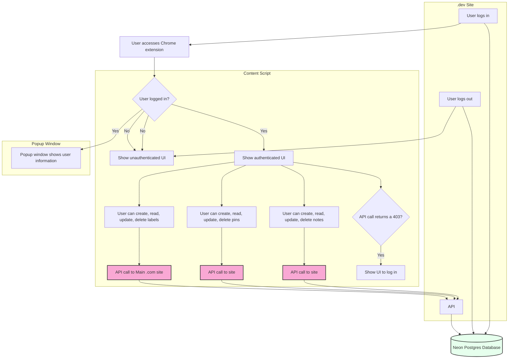

+++
title = "dossi is now open source"
description = "dossi, a browser extension and web app to keep track of your own private GitHub notes is now open source."
tags = ["chrome extension","firefox addon", "browser extension", "web app", "github", "notes", "open source", "serverless", "postgres", "nextjs", "nextauth", "prisma", "react-query", "stripe", "vercel"]

categories = ["Development"]
date = 2024-05-04T19:33:55-05:00
+++

[dossi](https://dossi.dev), a browser extension and web app to keep track of your own private GitHub notes is now open source.

- [Browser extension](https://github.com/siegerts/dossi-ext)
- [Web app and API](https://github.com/siegerts/dossi-ext)

## Backstory

I built dossi as a way to keep track of my own notes for GitHub issues and pull requests across multiple repositories and organizations.

Personally, a challenge that I kept running into was just saving general thoughts in the moment when I found a new open source project or issue that I knew I'd want to come back to later. Initially, this was to help with issue triage and reproducibility.

And for organizations that I was a part of, I wanted something more private than just having the GitHub visibility set to private (just for myself). I felt that the existing tools were too focused on teams building and collaborating on code, and not enough on the experience of those that are also supporting customers and users of the software. Later, I found that I was able to track increases in interest (reactions) on issues and keep track of the general sentiment around a request or issue.

Yes, there are GitHub notifications and stars, but that quickly becomes overwhelming especially when you're working across an organization or multiple organizations with a lot of repositories, in addition to your own personal projects.



## Development

The project (obviously) started as a closed source project. I wasn't 100% sure which direction to take it and, quite honestly, it just started as a fun project to build. This was also my first time building a browser extension so there were a lot of unknowns on how it would shape up.

Browser extensions definitely have their own set of challenges, especially when it comes to the UI and UX. I used the [Plasmo](https://github.com/PlasmoHQ/plasmo) extension framework to get started quickly, iterate fast, and not have to worry about the boilerplate code that comes with building a browser extension especially when it comes to the Manifest v3 configuration.

Most of the time spent was the parity between the extension and the web app with the UI look and feel. Extension content script styling has some challenges since you can have collisions with the host page's CSS. dossi uses [shadcn/ui](https://ui.shadcn.com/) for the UI components which made it easy to keep the UI look and feel consistent across the extension and the web app - but uses Tailwind for the styling. GitHub _also uses Tailwind_ so there are challenges that required some overrides to make sure the UI components looked consistent across the extension and the web app.

### Separating the extension and web app

The first decision is the separation of functionality between the browser extension and the web app.

Thinking back, I could have forgone the web app and just used the browser extension as the main interface. That may be something to consider in the future and would simplify the the architecture quite a bit. I wanted to have a meta view of all of the notes across all of the repositories and organizations that I was keeping track of - and filter and search across them.

That said, there is some nice flexibility in having the API separate from the extension. 

A few things come to mind...

#### Storage schema management 
Changes to the storage schema can be managed in the API (and API versioning) and not have to worry about the extension _and the extension review process_ that can take a few days to publish an updated version

#### Chrome storage API
Using the [chrome.storage](https://developer.chrome.com/docs/extensions/reference/api/storage) API is flexible but backwards compatibility can be a challenge. Typically, the first suggestion is to use a storage library or database but troubleshooting client-side migrations for users usually requires a an uninstall/reinstall of the extension. This is not ideal for a user that has a lot of notes saved since they will lose all of their notes. Users will likely just stop using the extension if they have to do this.

#### Data model complexity
The mental model of the Storage API can get complex quickly when the extension is interaction with it in multiple ways across background scripts, content scripts, and popup scripts.

#### Meta datatable view
The web app can be used as a backup for notes and also as a way to view notes across multiple devices. This is something that I thought could be a potential use case in the future.

#### Allow notes to be used outside of the extension

It felt limiting to restrict the notes to just the extension. I wanted to be able to use the notes in other applications and services. This is something that I haven't fully explored yet but I think it could be a powerful feature to have.

#### Integration with other services

I've given thought around integrating with other services like Slack, Discord, and email to send notifications and reminders about notes that are saved. And, also the ability to share notes with other users (or organizations) that are also using dossi.

### Auth state management

The extension and web app use [NextAuth.js](https://next-auth.js.org/) for authentication. This was a decision to reduce the friction of auth state between the extension and the web app. The extension uses the NextAuth.js client to authenticate and use the host permissions of the extension to use the session cookie to authenticate with the API. The host permissions are set to the API of the web app. This allows the extension to use the session cookie to authenticate with the API and not have to worry about the Chrome storage API to manage the auth state. Also, if a user is already authenticated with the web app, they will be automatically authenticated with the extension. This is a nice feature to have since the extension can be used across multiple devices and the auth state is managed in one place.

That said, although users sign in with their GitHub account, _the GitHub API is not used for data access or retrieval_. This was a decision to keep the notes private and not have to worry about the GitHub API rate limits. Also, I was contemplating of expanding the notes to other services and didn't want to be tied to the GitHub API.

The interaction between the extension and the web app is shown in the diagram below:

### Tech stack

The tech stack was largely driven by the use of Next.js, NextAuth.js, [Prisma](https://www.prisma.io/), and shadcn/ui. I've recently migrated the database to a serverless Postgres database using [Neon Postgres](https://neon.tech/) from MySQL (more on this in a future post). Locally, I build and test using a development database branch using Neon branches. I'd like to lean more into Postgres features and extensions in the future.

| Tech                | Description                     | Browser extension | Web app | API |
|---------------------|---------------------------------|:-------------------:|:---------:|:----------:|
| Plasmo             | browser extension framework     | ✅                |         |     |
| TypeScript         | language                        | ✅                | ✅      | ✅  |
| shadcn/ui          | UI components                   | ✅                | ✅      |     |
| [Tailwind](https://tailwindcss.com/)           | CSS                             | ✅                | ✅      |     |
| [TanStack/react-query](https://react-query.tanstack.com/) | data fetching                 | ✅                |         |     |
| [zod](https://github.com/colinhacks/zod)                | schema validation               | ✅                | ✅      | ✅  |
| Next.js            | framework                       |                   | ✅      |     |
| Neon Postgres    | Serverless Postgres database    |                   | ✅      | ✅  |
| Prisma             | database ORM and client         |                   | ✅      | ✅  |
| NextAuth.js        | auth                            | ✅                | ✅      | ✅  |
| [Stripe](https://stripe.com/)             | payments                        |                   | ✅      |     |
| Vercel             | deployments and hosting         |                   | ✅      |     |

As and aside, the use of TanStack/react-query was a game changer for me. I was able to remove a lot of boilerplate code for syncing data in the extension. I was able to consolidate the data fetching and caching logic. 

### Deployment

The API is hosted on Vercel and the extension is hosted on the Chrome Web Store and Firefox Add-ons. The extension submission process differs between the Chrome Web Store and Firefox Add-ons. 

For the extension, I haven't automated the end to end testing and deployment process. I like to spot the builds and versioning before uploading the artifacts to the web stores. 

The web app and API are integrated with the GitHub repos and automatically deploy on push to the main branch.

## Future plans

Overall, I'm excited to see what the community does with the project. It seemed a bit daunting to transition the project to open source but I'm excited to see how the project can be used in other ways that I haven't thought of yet.

I've already received some feedback and feature requests that I'm excited to work on, so stay tuned for updates.

If you have any feedback or feature requests, feel free to open an issue on the GitHub repositories below or reach out to me on Twitter [@siegerts](https://twitter.com/siegerts).

- [Browser extension](https://github.com/siegerts/dossi-ext)
- [Web app and API](https://github.com/siegerts/dossi-ext)

