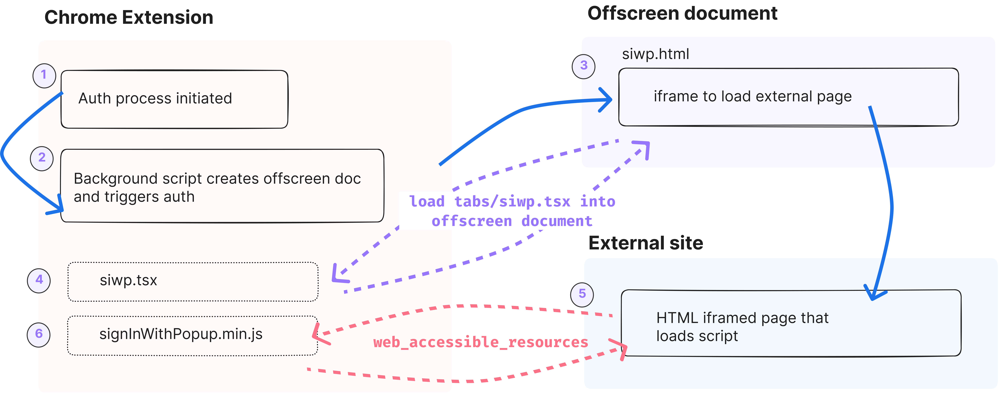

+++
title = "Using Firebase Auth in a Chrome Extension with Offscreen Documents and Plasmo"

description = "Adding Firebase Auth to a Chrome extension built with Plasmo using offscreen documents and using web_accessible_resources to load a script from the extension."

tags = [
    "chrome extension",
    "firebase",
    "oauth",
    "google oauth",
    "sign in with popup",
    "authentication",
    "chromium",
    "brave",
    "chrome",
    "plasmo",
    "firebase auth",
    "javascript",
    "bun",
]

categories = ["Development"]
date = 2024-09-19T07:25:16-04:00

series = "Developing Browser Extensions"

+++

This is a quick run through of the setup and configuration needed to use Firebase Auth in a Chrome extension built with [Plasmo](https://docs.plasmo.com/) in offscreen documents.

There is [Offscreen Documents documentation](https://firebase.google.com/docs/auth/web/chrome-extension#use_offscreen_documents) that this post draws from on the Firebase site about using Firebase Auth in Chrome extensions, but I found it a bit complex and incomplete as to what actually needs to be added to the extension to make it work. Also, there are some specific things that need to be done to make it work with Plasmo. Hopefully this helps to connect some of the dots.

Let's get started.


## Overview

So what actually is the process for offscreen _and_ `web_accessible_resources`?


_Web-accessible resources are files inside an extension that can be accessed by web pages or other extensions. Extensions typically use this feature to expose images or other assets that need to be loaded in web pages, but any asset included in an extension's bundle can be made web accessible._


<br />



<br />

Here's a high-level overview of the process:

1. The extension initiates the auth process. 
2. An offscreen document is created. An offscreen document is a hidden browser window that is not visible to the user but is managed by the extension. This window is used to handle the Firebase Auth process.
3. In the offscreen document, the extension will load an iframe that is an HTML page from the extension.
4. This page contains an iframe that points to an external site (your website) that will handle the Firebase Auth process.
5. This iframe page, when loaded, will load a script that is bundled with the extension that contains the Firebase Auth code. Configuring [`web_accessible_resources`](https://developer.chrome.com/docs/extensions/reference/manifest/web-accessible-resources) makes it possible for the external site to use the script from the extension.
6. The script will initiate the Firebase Auth process and open a Popup window for the user to sign in. Once the user completes (or cancels) the sign in process, the iframe'd page will send a message back ("up") to the extension with the user's credentials.

The extension will then use the credentials to sign in the user with Firebase Auth.

Yeah, that's a lot :rofl:. This post is just going to fill in some of the gaps to what is needed to make this work with Plasmo.


## Update the manifest permissions

First, you'll need to update the permissions of the extension. `offscreen` is required for this process to work. `tabs` is **optional** but is needed if you want to bring the auth window to the front when the user is signing in.

```json
{
  "permissions": [
    "offscreen",
    "tabs"
  ]
}

```

## Update the manifest web_accessible_resources

You'll also need to allow the iframe in the offscreen document to load the script that is bundled with the extension. This is done with the `web_accessible_resources` key in the manifest. So, when the iframe page loads, it can reference and load the `signInWithPopup.min.js` script that will be at the root of the extension project. Note, the `~` is a special character that tells Plasmo to look in the root of the project for the file when building for [web accessible resources](https://docs.plasmo.com/framework/assets#web-accessible-resources).

```json
{
  "web_accessible_resources": [
    {
      "resources": ["~signInWithPopup.min.js"],
      "matches": ["https://<your-website-page>.com/*"]
    }
  ]
}
```


## Create the offscreen document in the extension

In the extension project, create a new file in the `tabs` directory called `siwp.tsx`. This file will contain the code to create the offscreen document and handle the Firebase Auth process.

In this example, `siwp` stands for "Sign In With Popup" and will be used across the extension to refer to the offscreen document.


```tsx
// siwp.tsx
import { useEffect, useRef } from "react"

function Siwp() {
  const iframeRef = useRef<HTMLIFrameElement>(null)

  const handleChromeMessages = (message, sender, sendResponse) => {
    
    if (message.target !== "siwp" || message.type !== "siwp-auth") {
      sendResponse({ error: "Invalid message" })
      return false
    }

    function handleIframeMessage({ data }) {
      console.log("iframe message", data)
      try {
        if (data.startsWith("!_{")) {
          return
        }
        data = JSON.parse(data)
        self.removeEventListener("message", handleIframeMessage)

        sendResponse(data)
      } catch (e) {
        console.log(`json parse failed - ${e.message}`)
      }
    }

    globalThis.addEventListener("message", handleIframeMessage, false)

    return true
  }


  useEffect(() => {
    chrome.runtime.onMessage.addListener(handleChromeMessages)

    iframeRef.current.contentWindow.postMessage(
      { initAuth: true },
      new URL("chrome-extension://<your-chrome-extension-id>").origin,
    )

    return () => {
      chrome.runtime.onMessage.removeListener(handleChromeMessages)
    }
  }, [iframeRef.current])

  return (
    <div>
      test
      <iframe
        ref={iframeRef}
        id="siwp-iframe"
        title="siwp-iframe"
        src="<the-url-to-the-external-html-page>"
      />
    </div>
  )
}


export default Siwp
```

Let's go through the code above:

1. Create a functional component called `Siwp` that will be used to create the offscreen document.
2. Create an iframe reference that points to the page from the external site.
3. Create a function called `handleChromeMessages` that will handle messages sent from the extension with type `siwp-auth` and a target of `siwp`.
4. Add an event listener to listen for messages from the extension.
5. Send a message to the iframe to initialize the auth process (`initAuth`).


## Create the external HTML page

Okay, now we need to create the external HTML page that the iframe in the offscreen document will load. This page will contain the script that will be bundled with the extension and will handle the Firebase Auth process. This page will be hosted on your website and should match the URL in the `web_accessible_resources` key in the extension manifest:

```json
{
  "web_accessible_resources": [
    {
      "resources": ["~signInWithPopup.min.js"],
      "matches": ["https://<your-website-page>.com/*"]
    }
  ]
}
```


You can host this as a static page (i.e. Hugo) or on a server but there won't be any server-side code needed.


```html

<!DOCTYPE html>
<html>
  <head>
    <title>Sign In With Popup page</title>
    <script type="text/javascript">

      const EXTENSION_ORIGIN = "chrome-extension://<your-chrome-extension-id>";

      async function receiveMessage ({ origin }) {
      
        if (origin === EXTENSION_ORIGIN) {
          const script = document.createElement('script');
          
          // set the `src` to a URL of a file that is bundled with our extension.
          script.src = `${origin}/signInWithPopup.min.js`

          document.head.appendChild(script);
        }
      }

      window.addEventListener("message", receiveMessage, false);
    </script>
  </head>
</html>

```

So, when the page loads, it will listen for messages from the extension. When it receives a message from the extension, it will create a script element and set the `src` to the `signInWithPopup.min.js` file that will be bundled with the extension.

This allows the the script to run outside of the extension's restricted environment and have access to the Firebase Auth API. But, since we will be bundling the script from within the extension, it will be configured to work with the correct Firebase project.

Now, we need to create the `signInWithPopup.min.js` file that we've mentioned so many times. This file will contain the Firebase Auth code that will handle the sign in process.


## Create signInWithPopup.js and bundle with Bun

In the root of the extension project, create a new file called `signInWithPopup.js`. This file will contain the Firebase Auth code that will handle the sign in process. We will then bundle this file with Bun to create a minified version that we can use in the extension.

You'll need to update the `firebaseConfig` object with your Firebase project configuration. This is the same configuration that you would use in a web app. With Plasmo, you can use environment variables to store the configuration and then pass them in.


It's important to call out that within the extension you'll use methods from `firebase/auth/web-extensions` and not `firebase/auth`. This is because the `firebase/auth` package is not compatible with the Chrome extension environment. The `firebase/auth/web-extensions` package is specifically designed for use in Chrome extensions.

**But**, since the `signInWithPopup` script is executed on the external HTML page, it will be able to use the `firebase/auth` package. This is because the script is running outside of the extension.


```js
// signInWithPopup.min.js
import { signInWithPopup, GoogleAuthProvider, getAuth } from "firebase/auth"
import { initializeApp } from "firebase/app"

// this can not collide with firebase/auth/web-extensions
const firebaseConfig = {
  apiKey: "",
  authDomain: "",
  projectId: "",
  storageBucket: "",
  messagingSenderId: "",
  appId: "",
}

// Initialize Firebase
const app = initializeApp(firebaseConfig)
const auth = getAuth()

const PARENT_FRAME = document.location.ancestorOrigins[0]
const PROVIDER = new GoogleAuthProvider()

PROVIDER.setCustomParameters({
  showPrompt: "select_account",
})

// add scopes
// PROVIDER.addScope("")
// PROVIDER.addScope("")

signInWithPopup(auth, PROVIDER)
  .then((userCred) => {
    globalThis.parent.self.postMessage(
      JSON.stringify({ userCred }),
      PARENT_FRAME,
    )
  })
  .catch((error) => {
    console.error("Error during sign-in:", error)
  })
```

This example is using the GoogleAuthProvider, but you can use any of the other providers that Firebase Auth supports. You can also add additional scopes to the provider if needed.


### Bundle the script with Bun

Now, we need to bundle the script with Bun to create a minified version that we can use in the extension. I use [Bun](https://bun.sh/) for this, but you can use any other bundler that you prefer. This will create the `signInWithPopup.min.js` file in the root of the extension project.


```sh
bun build ./signInWithPopup.js --outfile ./signInWithPopup.min.js
```

The directory structure should now include the following files:

```
.
├── ...
├── background.ts // we'll update this next
├── signInWithPopup.js
├── signInWithPopup.min.js
├── tabs
│   └── siwp.tsx
│
...

```

Now, we need to update the background script to handle the auth process initiation and response from the offscreen document.


## Update the background script

In the `background.ts` file, we need to add the code to handle the auth process initiation and response from the offscreen document. This code will create the offscreen document, send a message to the offscreen document to start the auth process, and handle the response from the offscreen document with the user's credentials.


The `OFFSCREEN_DOCUMENT_PATH` is the path to the tab (`siwp.tx`) page that we created earlier. This path should match the path to the offscreen document in the extension project. When Plasmo builds the extension, it will convert the tsx file to an HTML file.


```ts
//background.ts

const OFFSCREEN_DOCUMENT_PATH = "tabs/siwp.html"

// A global promise to avoid concurrency issues
let creating
let locating

async function hasDocument() {
  // Check all windows controlled by the service worker to see if one
  // of them is the offscreen document with the given path
  const matchedClients = await clients.matchAll()

  return matchedClients.some(
    (c) => c.url === chrome.runtime.getURL(OFFSCREEN_DOCUMENT_PATH),
  )
}

async function setupOffscreenDocument(path) {
  if (!(await hasDocument())) {
    if (creating) {
      await creating
    } else {
      creating = chrome.offscreen.createDocument({
        url: path,
        reasons: [chrome.offscreen.Reason.DOM_SCRAPING],
        justification: "authentication",
      })

      await creating
      console.log("Offscreen document created successfully.")
      creating = null
    }
  }
}

// 3. Initiate the auth process by sending a message to the offscreen document
//    to pass into the IFrame
// 4. Handle the response from the offscreen document with the user's credentials
async function getAuth() {
  return new Promise(async (resolve, reject) => {
    // send message to offscreen document
    const auth = await chrome.runtime.sendMessage({
      type: "siwp-auth",
      target: "siwp",
    })

    auth?.name !== "FirebaseError" ? resolve(auth) : reject(auth)
  })
}

// 2. Set up the offscreen and then trigger the auth process
async function firebaseAuth() {
 
  await setupOffscreenDocument(OFFSCREEN_DOCUMENT_PATH)

  const auth = await getAuth()
    .then((auth) => {
      console.log("User Authenticated", auth)
      return auth
    })
    .catch((err) => {
      if (err.code === "auth/operation-not-allowed") {
        console.error(
          "You must enable an OAuth provider in the Firebase" +
            " console in order to use signInWithPopup. This sample" +
            " uses Google by default.",
        )
      } else {
        console.error(err)
        return err
      }
    })
    .finally(closeOffscreenDocument)

  return auth
}

async function closeOffscreenDocument() {
  if (!(await hasDocument())) {
    return
  }
  await chrome.offscreen.closeDocument()
}


// 1. Listen for the message from the extension to start the auth process
chrome.runtime.onMessage.addListener(async (message, sender, sendResponse) => {
  if (message.type === "siwp-auth-init") {

    const auth = await firebaseAuth()

    sendResponse(auth)
    return true
  }
})
```

Let's go through the code above:

1. Listen for the message from the extension with type `siwp-auth-init`. Once received, initiate the auth process by calling the `firebaseAuth` function.
2. Set up the offscreen document and then trigger the auth process by calling the `getAuth` function.
3. Initiate the auth process by sending a message to the offscreen document to start the auth process.
4. Handle the response from the offscreen document with the user's credentials.


### Bring the auth window to the front (optional)

If you want to bring the auth window to the front when the user is signing in, you can add the following code to the background script. This code will check if the user is on the Google OAuth page and bring the window to the front.

The `tabs` permission is required to use the `chrome.tabs` API. So, make sure you have added the `tabs` permission to the extension manifest [shown earlier](#update-the-manifest-permissions).

```ts
//background.ts
//... 
chrome.tabs.onUpdated.addListener((tabId, changeInfo, tab) => {
  if (
    tab.url.startsWith("https://accounts.google.com/o/oauth2/auth/") ||
    tab.url.startsWith("https://<firebase-project-id>.firebaseapp.com")
  ) {
    
    chrome.windows.update(tab.windowId, { focused: true })
    return
  }
})
```

Now that the user is signed in, you can use the user's credentials in the extension to sign in the user with Firebase Auth. This way you can manage the user's authentication state in the extension and use Firebase Auth to secure your extension.


## Add the sign in function to the extension

This is an example of how you can use the `signInWithPopup` function in the extension to initiate the auth process. This function will send a message to the offscreen document to start process. When the user completes the sign in process, the offscreen document will send a message back to the extension with the user's credentials. 


```ts
const onSignInWithPopup = async () => {
    try {
      await chrome.runtime
        .sendMessage({ type: "siwp-auth-init" })
        .then(async (auth) => {
          
          const { userCred } = auth

          const accessToken = userCred._tokenResponse.oauthAccessToken

          const credential = GoogleAuthProvider.credential(null, accessToken)

          try {
            await signInWithCredential(getAuth(), credential)
          } catch (e) {
            console.error("Could not log in. ", e)
          }
        })
    } catch (e) {
      console.error("Could not log in. ", e)
    }
  }

  ```

A few things to note:
- The `onSignInWithPopup` function will send the [`siwp-auth-init` message to the background script](#update-the-background-script) to start the auth process.
- The access token is extracted from the user's credentials and a credential is created with the access token.
- The `signInWithCredential` function is called with the credential to sign in the user with Firebase Auth.


Make sure to use `getAuth()` to get the `auth` object and not the auth object from the initialized Firebase app.


You may need to adjust the code depending on your sign in methods and providers.

## Final thoughts

There is a lot of back and forth in this process - to be honest, it's not my favorite. If possible, test this out before you get too far into development and realize it's not going to work for your use case. I ended up going with a [different approach for my extension](/post/chrome-extension-oauth-web-auth-flow-firebase-google/) because it was possible but only after I had spent a decent amount of time testing this approach.

