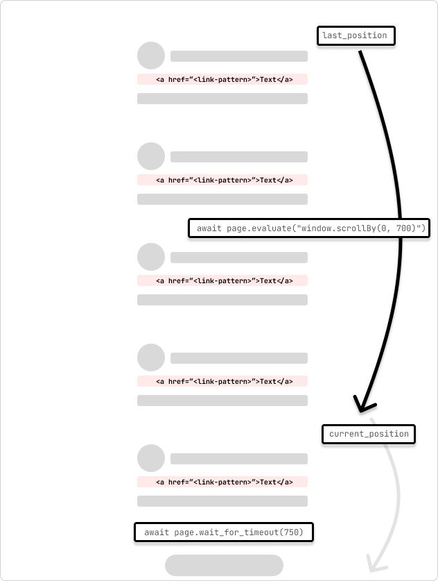

+++
title = "Crawling Pages with Infinite Scroll using Scrapy and Playwright"
description =  "Setting up a Scrapy spider to crawl pages with infinite scroll using Playwright and Chromium."

tags = [
  "web scraping",
  "scrapy",
  "playwright",
  "python",
  "javascript",
  "automation",
  "headless browser",
  "web crawler",
  "chromium",
  "firefox"
]

categories = [""]

date = 2024-08-08T10:33:55-05:00

+++

When crawling pages with [Scrapy](https://scrapy.org/) you'll quickly come across all sorts of scenarios that require you to get creative or interact with the page that you're trying to scrape. One of these scenarios is when you need to crawl an infinite scroll page. This type of website page loads more content as you scroll down the page like a social media feed.

There is definitely more than one way to crawl these types of pages. One way I recently approached this was to continue scrolling until the page length stopped increasing (i.e. scroll to the bottom). This post steps through this process.

This post assumes that you have a Scrapy project set up, running, and a Spider that you can modify and run.

## Using Playwright with Scrapy

This integration uses the [scrapy-playwright](https://github.com/scrapy-plugins/scrapy-playwright) plugin to integrate [Playwright for Python](https://playwright.dev/python/) with Scrapy. Playwright is a headless browser automation library used to interact with web pages and extract data.



I've been using [uv](https://github.com/astral-sh/uv) for Python package installation and management. 

Then, I use virtual environments right from uv with:

```bash
uv venv 
source .venv/bin/activate
```




Install the `scrapy-playwright` plugin and Playwright with the following command into your virtual environment:


```bash
uv pip install scrapy-playwright
```

Install the browser you want to use with Playwright. For example, to install Chromium, you can run the following command:

```bash
playwright install chromium
``` 

You can also install other browsers like Firefox if needed. 



The below Scrapy code and Playwright integration have only been tested with Chromium. 



Update the `settings.py` file or the `custom_settings` attribute in the spider to include the `DOWNLOAD_HANDLERS` and `PLAYWRIGHT_LAUNCH_OPTIONS` settings.

```python
# settings.py
TWISTED_REACTOR = "twisted.internet.asyncioreactor.AsyncioSelectorReactor"

DOWNLOAD_HANDLERS = {
    "http": "scrapy_playwright.handler.ScrapyPlaywrightDownloadHandler",
    "https": "scrapy_playwright.handler.ScrapyPlaywrightDownloadHandler",
}

PLAYWRIGHT_LAUNCH_OPTIONS = {
    # optional for CORS issues
    "args": [
        "--disable-web-security",
        "--disable-features=IsolateOrigins,site-per-process",
    ],
    # optional for debugging
    "headless": False,
},
```

For `PLAYWRIGHT_LAUNCH_OPTIONS` you can set the `headless` option to `False` to have the browser instance open and watch the process run. This is good for debugging and building out the initial scraper.

## Dealing with CORS Issues

I pass in the additional `args` to disable web security and isolate origins. This is useful when you are crawling sites that have CORS issues.

For example, there may be situations when required JavaScript assets are not loaded or network requests are not made because of CORS. You can isolate this faster by checking the browser console for errors if certain page actions (like clicking a button) are not working as expected but everything else is.

```python
"PLAYWRIGHT_LAUNCH_OPTIONS": {
    "args": [
        "--disable-web-security",
        "--disable-features=IsolateOrigins,site-per-process",
    ],
    "headless": False,
}
```

## Crawling Infinite Scroll Pages

This is an example of a spider that crawls an infinite scroll page. The spider scrolls the page by 700 pixels and waits for 750ms for the request to complete. The spider will continue to scroll until it reaches the bottom of the page indicated by the the scroll position not changing as it goes through the loop.



I'm modifying the settings in the spider itself using  `custom_settings` to keep the settings in one place. You can also add these settings to the `settings.py` file.



```python
# /<project>/spiders/infinite_scroll.py

import scrapy

from scrapy.spiders import CrawlSpider
from scrapy.selector import Selector


class InfinitePageSpider(CrawlSpider):
    """
    Spider to crawl an infinite scroll page
    """

    name = "infinite_scroll"

    allowed_domains = ["<allowed_domain>"]
    start_urls = ["<start_url>"]

    custom_settings = {
        "TWISTED_REACTOR": "twisted.internet.asyncioreactor.AsyncioSelectorReactor",
        "DOWNLOAD_HANDLERS": {
            "https": "scrapy_playwright.handler.ScrapyPlaywrightDownloadHandler",
            "http": "scrapy_playwright.handler.ScrapyPlaywrightDownloadHandler",
        },
        "PLAYWRIGHT_LAUNCH_OPTIONS": {
            "args": [
                "--disable-web-security",
                "--disable-features=IsolateOrigins,site-per-process",
            ],
            "headless": False,
        },
        "LOG_LEVEL": "INFO",
    }

    def start_requests(self):
        yield scrapy.Request(
            url=f"{self.start_urls[0]}",
            meta=dict(
                playwright=True,
                playwright_include_page=True,
            ),
            callback=self.parse,
        )


    async def parse(
        self,
        response,
    ):
        page = response.meta["playwright_page"]
        page.set_default_timeout(10000)
        
        await page.wait_for_timeout(5000)
            try:
                last_position = await page.evaluate("window.scrollY")

                while True:
                    # scroll by 700 while not at the bottom
                    await page.evaluate("window.scrollBy(0, 700)")
                    await page.wait_for_timeout(750) # wait for 750ms for the request to complete
                    current_position = await page.evaluate("window.scrollY")

                    if current_position == last_position:
                        print("Reached the bottom of the page.")
                        break

                    last_position = current_position

            except Exception as error:
                print(f"Error: {error}")
                pass

            print("Getting content")
            content = await page.content()

            print("Parsing content")
            selector = Selector(text=content)

            print("Extracting links")
            links = selector.xpath("//a[contains(@href, '/<link-pattern>/')]//@href").getall()

            print(f"Found {len(links)} links...")

            print("Yielding links")

            for link in links:
                yield {"link": link}


```

One thing that I've learned is that no two pages or sites are the same so you may need to adjust the scroll amount and wait time to account for the page and also any latency in the network round trips for the requests to complete. You can dynamically adjust this programmatically by checking the scroll position and the time it takes for the request to complete.

On the page load, I'm waiting a bit longer for the assets to load and the page to render. The Playwright page is passed to the `parse` callback method in the `response.meta` object. This is used to interact with the page and scroll the page. This is specified in the `scrapy.Request` arguments with the `playwright=True` and `playwright_include_page=True` options.

```python {linenos=inline, hl_lines=["5-6"]}
def start_requests(self):
    yield scrapy.Request(
        url=f"{self.start_urls[0]}",
        meta=dict(
            playwright=True,
            playwright_include_page=True,
        ),
        callback=self.parse,
    )
```


This spider will [scroll the page with `page.evaluate`](https://playwright.dev/docs/api/class-page#page-evaluate) and the [scrollBy() JavaScript method](https://developer.mozilla.org/en-US/docs/Web/API/Window/scrollBy) by 700 pixels and then wait for 750ms for the request to complete. Then, the Playwright page content is copied to a Scrapy selector, and extract the links from the page. The links are then yielded to the Scrapy pipeline to continue processing.




<figcaption><small>Infinite Scroll Scrapy Playwright</small></figcaption>


For situations where the page requests begin to load duplicate content, you can add a check to see if the content has already been loaded and then break out of the loop. Or, if you have an idea of the number of scroll loads, you can add a counter to break out of the loop after a certain number of scrolls plus/minus a buffer.


## Infinite Scroll with an Element Click

It's also possible that the page may have an element that you can scroll to (i.e. "Load more") that will trigger the next set of content to load. You can use the `page.evaluate` method to scroll to the element and then click it to load the next set of content.

```python
...

try:
    while True:
        button = page.locator('//button[contains(., "Load more")]')
        await button.wait_for()

        if not button:
            print("No 'Load more' button found.")
            break

        is_disabled = await button.is_disabled()
        if is_disabled:
            print("Button is disabled.")
            break

        await button.scroll_into_view_if_needed()
        await button.click()
        await page.wait_for_timeout(750)

except Exception as error:
    print(f"Error: {error}")
    pass

...
```

This method is useful when you know the page has a button that will load the next set of content. You can also use this method to click on other elements that will trigger the next set of content to load. The `scroll_into_view_if_needed` method will scroll the button or element into view if it is not already visible on the page. This is one of those scenarios when you will want to double-check the page actions with `headless=False` to see if the button is being clicked and the content is being loaded as expected before running a full crawl.



As mentioned above, confirm that the page assets(`.js`) are loading correctly and that the network requests are being made so that the button (or element) is mounted and clickable.




## Wrapping Up

Web crawling is a case-by-case scenario and you will need to adjust the code to fit the page that you are trying to scrape. The above code is a starting point to get you going with crawling infinite scroll pages with Scrapy and Playwright. 

Hopefully, this helps to get you unblocked! :raised_hands:


---